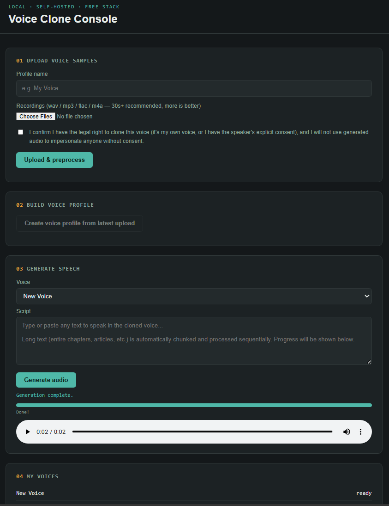

# Voice Clone App — Free / Open-Source MVP

A working local voice cloning + speech generation app built entirely from
free, open-source components. No paid APIs, no cloud bill required.

## What's included

- **Backend**: FastAPI + SQLite + Coqui XTTS v2 (zero-shot voice cloning)
- **Preprocessing**: format conversion, volume normalization, silence
  trimming, voice-activity detection (rejects music/silence-heavy clips)
- **Frontend**: single-page HTML/JS console (no build step, no Node needed)
- **Storage**: local disk (`uploads/`, `embeddings/`, `generated_audio/`)
- **Ethics/safety**: mandatory consent checkbox before upload, metadata
  watermark + generation log on every output, one-click profile deletion

## Screenshots



## License

**App code:** This repository's own source code is licensed under the
[MIT License](LICENSE) — free for any use, including commercial.

**XTTS v2 model:** The app depends on Coqui XTTS v2, which is free to
download and run but ships under Coqui's **CPML (Coqui Public Model
License)** — free for personal, research, and non-commercial use only. If
you ever want to charge users or run this as a paid product, you'd need a
commercial license from Coqui (or swap in a fully commercial-friendly model
like OpenVoice or F5-TTS, which have more permissive licenses).

## Setup

### 1. System dependencies (one-time)
```bash
# ffmpeg is required by pydub for format conversion — free system package
# macOS
brew install ffmpeg
# Ubuntu/Debian
sudo apt-get install ffmpeg
```

### 2. Python environment
```bash
cd voice-clone-app/backend
python3 -m venv venv
source venv/bin/activate       # Windows: venv\Scripts\activate
pip install -r requirements.txt
```

> First run will download the XTTS v2 model weights (~2GB) automatically —
> free, from Hugging Face. GPU is optional but strongly recommended;
> CPU-only works but generation will take 30–90s+ per sentence instead of a
> few seconds.

### 3. Run the server
```bash
uvicorn main:app --reload --port 8000
```

Open **http://localhost:8000** — the frontend is served automatically.

## How it maps to the original spec

| Spec item | This MVP |
|---|---|
| `POST /upload-voice`, `/preprocess` | combined into one `/upload-voice` call that preprocesses inline |
| `POST /create-voice-profile` | implemented — computes & caches XTTS speaker latents |
| `POST /generate-audio`, `GET /audio/{id}` | implemented |
| `DELETE /voice-profile/{id}`, `GET /voices` | implemented |
| PostgreSQL / Supabase | SQLite (swap-compatible schema, see `database.py`) |
| S3 / R2 storage | local disk (swap for boto3/R2 client later, same file paths) |
| Auth (Clerk/Auth.js/Firebase) | not included in MVP — add before any multi-user or public deployment |
| Multi-speaker rejection | not yet automated (needs speaker diarization, e.g. pyannote.audio — a good next step) |
| Watermarking | basic metadata tagging + DB log (see `watermark.py`); for tamper-resistant watermarking, look at Meta's open-source AudioSeal later |
| Next.js/React frontend | replaced with a single static HTML page for zero-cost, zero-build MVP; can be upgraded to Next.js without touching the backend API |

## Known limitations of this MVP (by design, to stay free & simple)

- Single-user, no login — anyone with access to the URL can use it. Fine for
  local/personal use; add auth before exposing it publicly.
- No automatic rejection of multi-speaker recordings yet (VAD catches
  silence/music, not "two people talking").
- **In-memory job tracking is lost on server restart** — the `_jobs` dict in
  `main.py` tracks generation progress in memory only. If the server restarts,
  all in-flight jobs are lost. A production version should persist job state to
  SQLite (or a queue like Redis) alongside generations.
- Generation is synchronous — a long script will make the request wait.
  For long-form scripts, chunk the text client-side or add a background
  job queue (e.g. free `arq` or `celery` + Redis) later.
- CORS is wide open (`*`) — tighten before deploying anywhere public.

## GitHub metadata

**Description**: Free/open-source local voice cloning app using Coqui XTTS v2,
FastAPI, and SQLite. Zero-shot voice cloning, speech generation, ethical safeguards.

**Topics**: `voice-cloning`, `text-to-speech`, `fastapi`, `xtts`, `coqui`,
`tts`, `open-source`, `ai-voice-cloning`, `python`

> Add these under your repository's "About" section on GitHub for discoverability.

## Next steps if you want to grow this

1. Add authentication (Auth.js is free and self-hostable).
2. Move from SQLite → Postgres when you have concurrent users.
3. Swap local disk for Cloudflare R2 (has a free tier) once you deploy off
   your own machine.
4. Add background job processing for long scripts / batch generation.
5. Add speaker diarization to auto-reject multi-speaker uploads.
