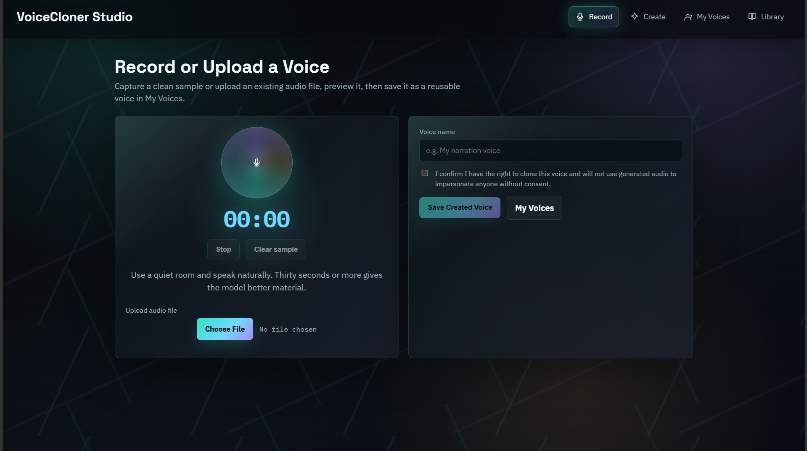
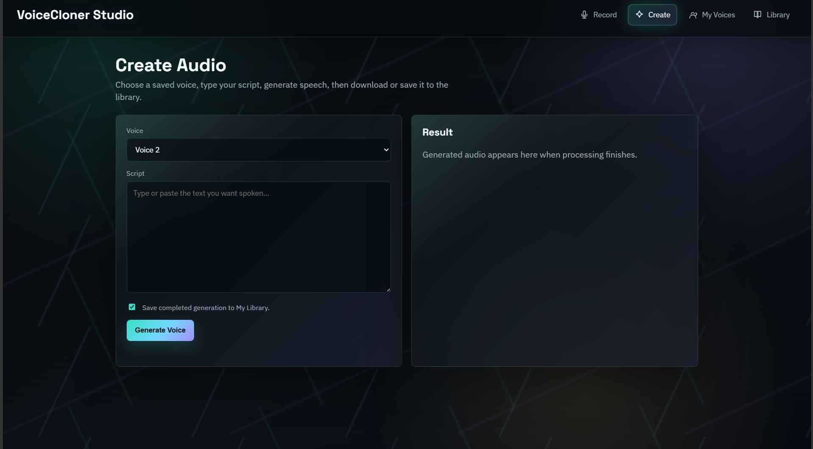
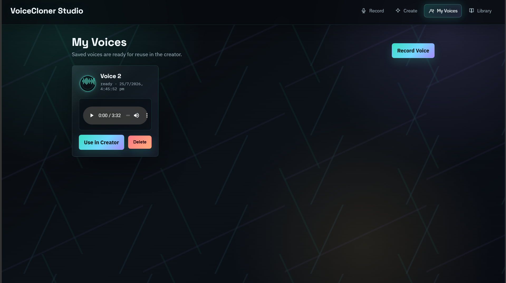
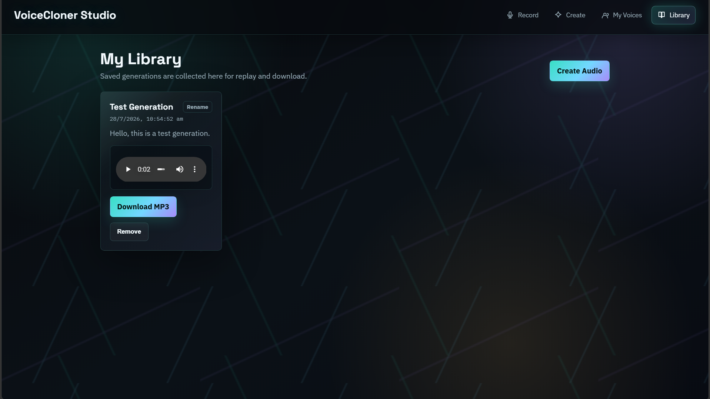

<div align="center">

# VoiceCloner

### A free, open-source local voice cloning + speech generation app — no paid APIs, no cloud bill

[](https://github.com/arya-lunawat/VoiceCloner/actions/workflows/ci.yml)
[](LICENSE)
[](https://python.org)
[](https://fastapi.tiangolo.com)
[](https://github.com/coqui-ai/TTS)

[Overview](#-overview) · [Screenshots](#-screenshots) · [Features](#-features) · [Tech Stack](#-tech-stack) · [API Reference](#-api-reference) · [Getting Started](#-getting-started) · [Known Limitations](#-known-limitations)

</div>

---

## 🎯 Overview

VoiceCloner is a working, self-hostable voice cloning and text-to-speech app built entirely from free, open-source components. Record or upload a short voice sample, and the app computes a reusable speaker embedding using **Coqui XTTS v2** (zero-shot voice cloning) — no fine-tuning, no paid API, no cloud dependency.

The backend handles preprocessing (format conversion, normalization, silence trimming, voice-activity detection), long-form text chunking for generation, job tracking, and a small ethics layer (consent gating, watermarking, one-click deletion). The frontend is a single static HTML/JS page — no build step, no Node required — served directly by the backend.

---

## 🖼 Screenshots

<table>
  <tr>
    <td align="center"><b>Record</b></td>
    <td align="center"><b>Create</b></td>
  </tr>
  <tr>
    <td></td>
    <td></td>
  </tr>
</table>

<table>
  <tr>
    <td align="center"><b>My Voices</b></td>
    <td align="center"><b>Library</b></td>
  </tr>
  <tr>
    <td></td>
    <td></td>
  </tr>
</table>

---

## ✨ Features

- 🎙 **Zero-shot voice cloning** — record or upload a short sample, get a reusable speaker embedding via Coqui XTTS v2, no fine-tuning required
- 🧹 **Automatic preprocessing** — format conversion, volume normalization, silence trimming, and voice-activity detection (rejects music/silence-heavy clips)
- ✂️ **Long-form text chunking** — splits long scripts into TTS-friendly chunks while respecting sentence and paragraph boundaries (abbreviation-aware, so "Dr." or "Mr." doesn't get treated as a sentence break)
- 📚 **Voice + generation library** — save voice profiles, generate speech, save favorite generations, rename or delete them
- 🔒 **Ethics/safety by design** — mandatory consent checkbox before any upload, metadata watermark + generation log on every output, one-click full profile deletion (recording, embedding, and generations)
- 🖥 **Zero-build frontend** — a single static HTML/JS console served directly by FastAPI, no Node or bundler needed
- ⚙️ **Async job tracking** — generation requests return a `job_id` immediately and can be polled for status, so long scripts don't block the request

---

## 🛠 Tech Stack

| Layer | Technology |
|---|---|
| Backend | FastAPI, Uvicorn |
| Database | SQLite |
| Voice cloning / TTS | Coqui XTTS v2 |
| Audio processing | librosa, soundfile, pydub, webrtcvad |
| Watermarking / metadata | mutagen |
| Frontend | Vanilla HTML/JS (no build step) |
| Testing | pytest, httpx, FastAPI TestClient |
| CI | GitHub Actions |

---

## 📡 API Reference

All routes are implemented in `backend/main.py`. The frontend only talks to this API — there is no other backend surface.

| Route | Purpose |
|---|---|
| `POST /voice-profiles` | Upload/record a voice sample, preprocess it, and compute the reusable XTTS speaker embedding |
| `GET /voice-profiles?saved=true` | List saved voice profiles |
| `GET /voice-profiles/{id}/recording` | Stream back the original source recording |
| `DELETE /voice-profiles/{id}` | Delete a voice profile and every file associated with it |
| `POST /generations` | Start a (possibly long-form, chunked) text-to-speech generation job; returns a `job_id` immediately |
| `GET /generations/{job_id}/status` | Poll job progress (`processing` / `completed` / `failed`) |
| `GET /generations/{id}/audio?format=wav\|mp3` | Download/stream the generated audio |
| `POST /generations/{id}/save` | Toggle whether a generation is kept in the library |
| `GET /library` | List generations saved to the library |
| `DELETE /library/{id}` | Remove a generation from the library |
| `PATCH /library/{id}` | Rename a saved generation |

---

## 🚀 Getting Started

### Prerequisites

- Python 3.11
- `ffmpeg` (required by `pydub` for format conversion)
- pip

### 1. System dependencies (one-time)

```bash
# macOS
brew install ffmpeg
# Ubuntu/Debian
sudo apt-get install ffmpeg
```

### 2. Python environment

```bash
cd backend
python3 -m venv venv
source venv/bin/activate       # Windows: venv\Scripts\activate
pip install -r requirements.txt
```

> First run will download the XTTS v2 model weights (~2GB) automatically from Hugging Face — free. GPU is optional but recommended; CPU-only works but generation takes 30–90s+ per sentence instead of a few seconds.

### 3. Run the server

```bash
uvicorn main:app --reload --port 8000
```

Open **http://localhost:8000** — the frontend is served automatically, with four tabs: **Record**, **Create**, **My Voices**, and **Library**.

---

## 📁 Folder Structure

```
VoiceCloner/
├── backend/
│   ├── main.py            # FastAPI routes, job tracking
│   ├── chunking.py        # sentence/paragraph-aware text chunking
│   ├── preprocessing.py   # format conversion, normalization, VAD
│   ├── tts_engine.py      # XTTS v2 wrapper
│   ├── watermark.py       # metadata tagging
│   ├── database.py        # SQLite schema/access
│   ├── requirements.txt
│   └── requirements-dev.txt
├── frontend/
│   └── index.html         # single-page console (Record / Create / My Voices / Library)
├── tests/
│   ├── test_api_endpoints.py
│   ├── test_backend_import.py
│   ├── test_chunking.py
│   └── test_preprocessing.py
├── screenshots/
├── .github/workflows/ci.yml
└── LICENSE
```

---

## ⚠️ Known Limitations

- Single-user, no login — fine for local/personal use; add auth before exposing it publicly.
- No automatic rejection of multi-speaker recordings yet (VAD catches silence/music, not "two people talking").
- **In-memory job tracking** — generation progress lives in memory only and is lost on server restart. A production version should persist job state to SQLite (or a queue like Redis).
- Generation is synchronous per chunk — long scripts hold the request open; a background job queue would help at scale.
- CORS is wide open (`*`) — tighten before deploying anywhere public.

---

## 📦 License

**App code**: licensed under the [MIT License](LICENSE) — free for any use, including commercial.

**XTTS v2 model**: ships under Coqui's **CPML (Coqui Public Model License)** — free for personal, research, and non-commercial use. For a paid product, you'd need a commercial license from Coqui, or a fully commercial-friendly model like OpenVoice or F5-TTS.

---

## 🔭 Next Steps

1. Add authentication (e.g. Auth.js, free and self-hostable).
2. Move from SQLite → Postgres for concurrent users.
3. Swap local disk for Cloudflare R2 (free tier) once deployed off your own machine.
4. Add background job processing for long scripts / batch generation.
5. Add speaker diarization to auto-reject multi-speaker uploads.

---

## 👨‍💻 Author

**Arya Lunawat**

[](https://github.com/arya-lunawat)

---

<div align="center">
  <sub>Built with FastAPI, Coqui XTTS v2, and a lot of debugging.</sub>
</div>
